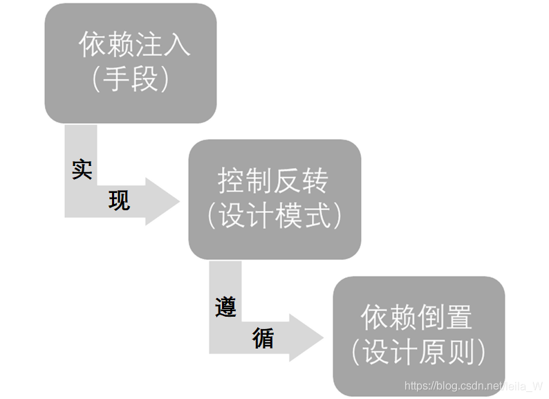
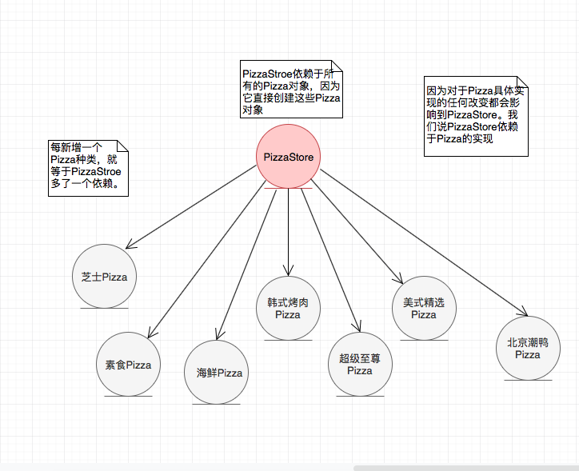
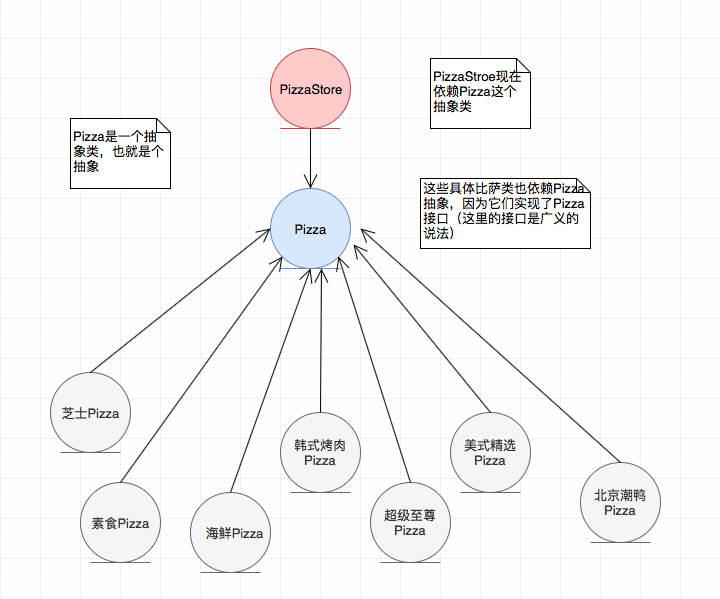

# DesignPattern
设计模式学习

## 1. 依赖倒置

**依赖倒置原则（DIP）、依赖注入（DI）、控制翻转（IOC）三者的关系**

DependencyInjection目录下代码中pizza的例子，倒置前：

倒置后：

> 图一的依赖箭头都是从上往下的，图二的箭头出现了从下往上，依赖关系确实“倒置”了
>
> 另外，此例子也很好的解释了“上层模块不应该依赖底层模块，它们都应该依赖于抽象。”，在最开始的设计中，高层模块PizzaStroe直接依赖低层模块（各种具体的Pizaa）,调整设计后，高层模块和低层模块都依赖于抽象（Pizza）

